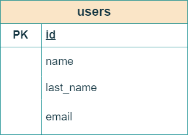

# 💻 Samsung Developer Women

## 🏛️ Bejob - Camilo Jose Cela University

## 📜 Full Stack Development. Level 3. Ed 2022

### 🎓 Database Lab: MySQL database

## 🤵 Mentor

Angel Garcia Lupiañez

## ✍ Instructions

1. Upload a SQL file that hosts a table named 'users', with fields 'id, name, last name, and email'.

2. The id field should be Primary Key and auto incremented.

3. The fields name, last name, and email should be Varchar(20).

### Table

### SQL file

[Database](users.sql)

### 🛠 Tools

| Tool       | Version |
| ---------- | ------- |
| phpMyAdmin SQL Dump  |5.1.1   |
| Visual Studio Code   | 1.77.3 |

### 📑 How to use it

- Import this [Database](users.sql) from XAMPP.
- Then, you can write queries and fetch, insert or delete records.

### 🔑 License

- [MIT License](LICENSE)
